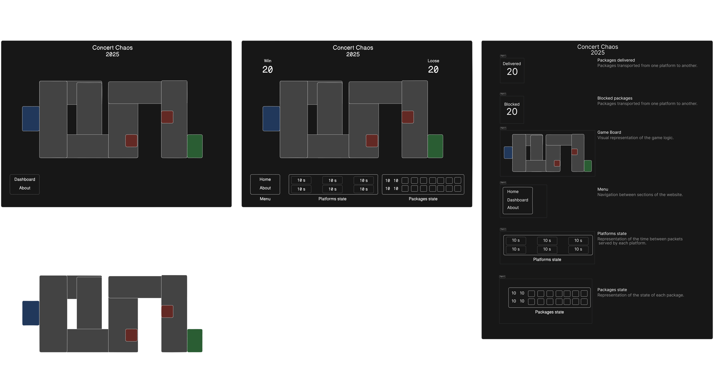

# Concert Chaos



# Game Platform Documentation

## Overview

Game platform focused on transporting packages across road sections. The primary objective is to maximize the score by efficiently managing package transportation without blocking road sections.

## Game Objective

- **Primary Goal**: Transport packages without blocking road sections.
- **Scoring**: Maximize the score by transporting as many packages as possible.

## Game Mechanics

### Package Handling

- **Direction Search**: Packages have the ability to search for directions to move.
- **Blocked Packages**: If a package cannot find a road, it gets blocked, reducing the score.

### User Configuration

- **Interval Time**: Users can configure the interval time for serving packages.

## Features

- **Direction Search**: A feature that allows packages to search for available directions to move.
- **User-Configurable Interval**: Users can set the interval time for package serving to optimize gameplay.

## Scoring System

- **Score Maximization**: Transport as many packages as possible to increase the score.
- **Penalty**: Blocking road sections results in a score reduction.

## Troubleshooting

- **Blocked Packages**: Ensure that road sections are not blocked to prevent packages from getting stuck.
- **Interval Configuration**: Adjust the interval time to find the optimal balance for package serving.

## Conclusion

This game platform challenges users to strategically manage package transportation across road sections. By configuring the interval time and ensuring roads are not blocked, users can maximize their scores and achieve the game's objectives.

## Technologies

The game uses the following technologies:

- **Vite**: development server
- **React**: for the user interface
- **TypeScript**: for the type safety
- **Tailwind CSS**: for the styling
- **Canvas**: for drawing the circuit and the packages

## Game play

The game is easy to play. The canvas is used to draw the circuit and the packages. The player has to click the platforms on the canvas to add a package to the circuit. The package will be drawn on the canvas and move to the next platform. The player has to click on the canvas again to add a new package. The game will end when the player cannot add a new package to the circuit without blocking or saturating the transportation circuit.

## Execute the project

1. Clone the project
2. Run `npm install` to install the packages
3. Run `npm run dev` to start the project
4. Open `http://localhost:3000` in your browser

## Project Structure

The project is structured in the following folders:

```

src/
├── App.tsx
├── assets/
│   └── react.svg
├── components/
│   ├── Footer.container.tsx
│   ├── Header.container.tsx
│   ├── MenuDropDown.component.tsx
│   ├── ProfileDropDownMenu.component.tsx
│   └── Sidebar.component.tsx
├── features/
│   ├── Conveyor/
│   │   ├── Conveyor.container.tsx
│   │   ├── interfaces/
│   │   │   ├── Conveyor.interface.ts
│   │   │   └── Route.interface.ts
│   │   └── utils/
│   │       └── ConveyorColors.util.ts
│   ├── about/
│   │   ├── About.container.tsx
│   │   └── components/
│   │       ├── AboutSection.component.tsx
│   │       └── AboutSectionContent.component.tsx
│   ├── auth/
│   │   ├── Auth.container.tsx
│   │   ├── components/
│   │   │   └── AuthBackgroud.component.tsx
│   │   ├── context/
│   │   │   └── Auth.context.tsx
│   │   ├── hooks/
│   │   │   └── useAuth.tsx
│   │   ├── interfaces/
│   │   │   └── AuthContext.interface.ts
│   │   └── services/
│   │       └── Auth.service.ts
│   ├── board/
│   │   ├── board.container.tsx
│   │   ├── context/
│   │   │   └── Board.context.tsx
│   │   ├── enums/
│   │   │   ├── SpeedOption.ts
│   │   │   └── StatusAction.ts
│   │   ├── hooks/
│   │   │   └── useBoard.tsx
│   │   ├── interfaces/
│   │   │   ├── BoardContext.interface.ts
│   │   │   ├── Node.interface.ts
│   │   │   └── Square.interface.ts
│   │   └── utils/
│   │       ├── CheckBoxCollisions.util.ts
│   │       ├── GridBoard.util.ts
│   │       ├── ManhattanDistance.util.ts
│   │       └── Draw[...].util.ts
│   ├── box/
│   │   ├── Box.container.tsx
│   │   ├── interfaces/
│   │   │   └── Box.interface.ts
│   │   ├── models/
│   │   │   └── Box.ts
│   │   └── utils/
│   │       └── BoxColors.utils.ts
│   ├── dashboard/
│   │   ├── Dashboard.container.tsx
│   │   └── components/
│   │       ├── MenuBox.component.tsx
│   │       ├── MenuBoxStatus.component.tsx
│   │       ├── MenuModalGame.component.tsx
│   │       ├── MenuPackingStation.component.tsx
│   │       ├── MenuRoutesSummary.component.tsx
│   │       └── MenuScore.component.tsx
│   ├── level/
│   │   ├── interfaces/
│   │   │   └── Levels.interface.ts
│   │   └── utils/
│   │       └── Levels.util.ts
│   ├── packingStation/
│   │   └── interfaces/
│   │       └── PackingStation.interface.ts
│   └── scores/
│       ├── Scores.container.tsx
│       └── components/
│           └── ScoreSection.component.tsx
├── index.css
├── main.tsx
└── vite-env.d.ts

```
